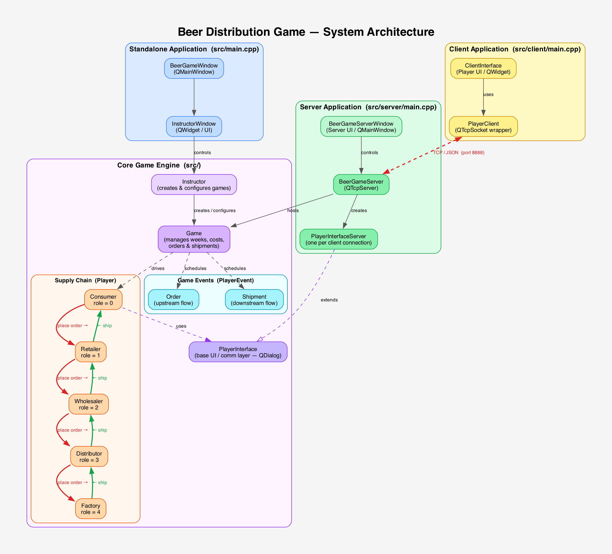

##### se-03-team-24
# Beer Game

This project simulates the way beer is being ordered and delivered from production and factory,going to distributor, then wholesaler and then to retailer and consumer. Each of these stages can be played by the students who, order enough beer stock in the position theyhold, taking into consideration shipment times, delays, backorders, inventory such that,every partner in this chain doesn’t suffer any losses. The objective of the game is to satisfy the demand of the customer, while keepingthe cost low. 

The main features in the repository that I developed:
* Created a fully functional game that can be played locally from the system level architecture 
* Added networking capabilities such that the game can be hosted on a server and players can play in LAN in multiple computers. 
* Added relevant comments in the code for doxygen.
* Added functionality tests for the game.
* Updated code organization

### System Architecture



The system is built with **Qt (C++)** and consists of three deployable executables sharing a common core game engine:

- **Standalone** (`beergame`) — all five supply chain roles run on one machine, controlled by an Instructor.
- **Server** (`beergame-server`) — hosts the game via TCP; one `PlayerInterfaceServer` is created per connected client.
- **Client** (`beergame-client`) — each player connects over TCP/JSON (port 8888) and interacts through `ClientInterface`.

The **supply chain** runs Consumer → Retailer → Wholesaler → Distributor → Factory. Orders flow upstream (red) and shipments flow downstream (green), both scheduled week-by-week by the `Game` class.

### Building the game
```
cd {to-project-directory}
mkdir build
cd build
cmake ..
make
```
Now, three executables are available:
* beergame : Standalone executable to play the game in a single computer
* beergame-server: This provides selection of an ip-address and a port, such that clients can run *beergame-client* to start the game.
* beergame-client: Helps to connect to beergame-server to play the game.

### How to play the game:
#### Locally:
* Run *beergame*
* Click **Play as guest Instructor**
* Specify settings
* Click Start game
* Now windows for all four players will apper

#### In a LAN:
* Run *beergame-server*
* Enter an ip and port that are available in the lan.
* Start *beergame-client* from client computers. Enter the ip-address and port on which the server is running.
* Then you will be prompted to enter the game and role. As of now, only one game can be played in a LAN. So enter '1'.
* For role each player can chose from {1,2,3,4}. Duplications will make the game invalid.
* After all players have conencted, the game will start automatically.

### Sample screenshots of the game

#### Server:

#### Client:

